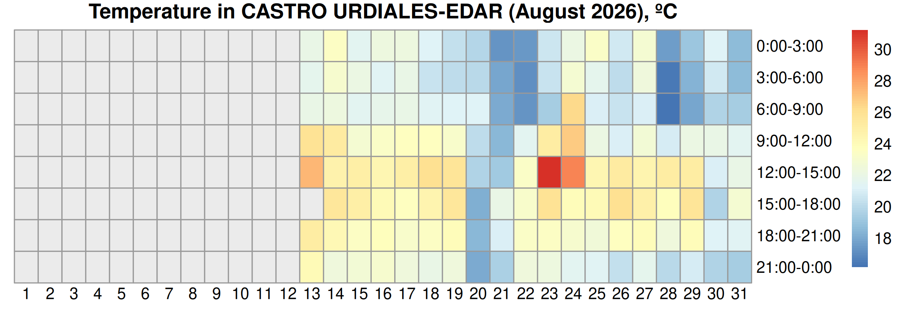

# R_weather_plot

Monthly weather heatmaps built from a continuously accumulated feed of
[AEMET OpenData](https://opendata.aemet.es/) surface observations.

This project is my attempt to dip a toe into R by applying newly learned skills
to a real weather-data workflow.

## Heatmap examples

### Current AEMET feed



This heatmap uses the current AEMET feed for Castro Urdiales-EDAR. The feed
only started polling on 2026-08-13, so days before that remain blank in any
given month, and August 2026 in particular is incomplete for that reason. The
grid fills in as further months accumulate a full 6-hourly polling history.

## How the feed works

AEMET's station endpoint
`/api/observacion/convencional/datos/estacion/{idema}` only returns the **last
~12 hours** of observations. There is no sub-daily historical endpoint: the
historical service (`/api/valores/climatologicos/diarios/...`) is **daily
aggregates only** (`tmed`, `tmin`, `tmax`, `prec`, `velmedia`, `racha`, `sol`,
`presMax`/`presMin`) and cannot fill a 3-hour-bin heatmap. The two datasets do
**not** share a parameter set.

Consequently the project polls the station endpoint on a schedule and appends
into the SQLite snapshot stored in R2. `(idema, fint)` is the primary key, so overlapping
windows and re-runs are idempotent: a poll returning a timestamp already stored
replaces that row only if the payload actually changed, otherwise it is skipped.
AEMET does revise recent observations, so this is last-write-wins — superseded
values are not retained.

The default station is **`1083L` — CASTRO URDIALES-EDAR** (Cantabria), which
reports hourly. Fields vary by station: this one leaves `ts`, `tss5cm`,
`tss20cm`, `nieve`, `inso`, `rviento` and `vis` empty, which the client treats
as `NA` rather than an error.

Requests use the two-step AEMET protocol: the first response is a JSON envelope
carrying a short-lived `datos` URL; the payload behind it is ISO-8859-15.

<!-- feed-stats:start -->
_Generated from the active SQLite snapshot in Cloudflare R2._
- **CASTRO URDIALES-EDAR** (`1083L`): 66 observations, 2026-08-31 to 2026-09-03 UTC, 100.0% hourly coverage
- Completed heatmaps retained: **1**
<!-- feed-stats:end -->

## Layout

| Path | Purpose |
| --- | --- |
| [R/config.R](R/config.R) | Default station and environment overrides |
| [R/aemet.R](R/aemet.R) | API client, response normalisation |
| [R/store.R](R/store.R) | SQLite schema, upsert, queries |
| [R/plot_heatmap.R](R/plot_heatmap.R) | Binning and `pheatmap` rendering |
| [scripts/fetch.R](scripts/fetch.R) | Polling entry point |
| [scripts/render_heatmap.R](scripts/render_heatmap.R) | Plot entry point |
| [scripts/update_stats.R](scripts/update_stats.R) | Generated README feed statistics |
| [scripts/cleanup_month.R](scripts/cleanup_month.R) | Dry-run and monthly cleanup logic |
| [tests/testthat](tests/testthat) | Network-free tests for parsing, storage, and binning |
| [heatmap_project.r](heatmap_project.r) | Interactive fetch + plot |

## Setup

```r
install.packages(c("httr2", "jsonlite", "DBI", "RSQLite",
                   "dplyr", "lubridate", "reshape2", "pheatmap", "testthat"))
```

Put the key in a `.Renviron` file **in the project root** (gitignored):

```
AEMET_API_KEY=your_key_here
```

R reads `.Renviron` from the working directory at startup before falling back to
`~`. Project-local is preferred here because `~` may be redirected to a
cloud-synced folder (OneDrive et al.), which is a poor place for a credential.
Check with `path.expand("~")` if the key seems not to load, and remember
`.Renviron` is only read at session start.

Verify with:

```sh
Rscript scripts/setup.R
```

## Usage

```sh
Rscript scripts/fetch.R
Rscript scripts/render_heatmap.R 2026 8 ta
```

The default station is configured once in `R/config.R`. Pass station codes as
arguments for a one-off fetch or set `AEMET_STATIONS` to a comma- or
space-separated list to fetch multiple stations without changing the scripts.
The live SQLite file is stored in R2 rather than Git; for local rendering,
restore `snapshots/weather.sqlite` to `data/weather.sqlite` first, or run a
local fetch with `AEMET_API_KEY` configured.

Supported parameters include `ta` (temperature), `hr`, `pres`, `prec`, `vv`.
Precipitation is summed per bin, everything else is averaged.

## Tests

The test suite uses synthetic observations and never calls AEMET:

```sh
Rscript tests/testthat.R
```

It covers optional fields and timestamps in the AEMET normaliser, idempotent
and revision-aware SQLite writes, UTC-to-local-time conversion, complete month
matrix dimensions, and precipitation sums within a 3-hour bin. The same suite
runs in GitHub Actions on pushes and pull requests.

## Monthly cleanup

After a month is complete, review its heatmap before removing its detailed rows
from the active SQLite snapshot. The manual [cleanup workflow](.github/workflows/cleanup-month.yml)
requires an explicit year and month and defaults to a non-destructive dry run:

```text
Actions -> Clean up completed weather month -> Run workflow
year: 2026
month: 9
dry_run: true
```

The dry run renders a preview artifact and reports the row count without
uploading, deleting, or changing the R2 snapshot. After checking that preview,
run the same month again with `dry_run: false`. The destructive run uploads the
reviewed heatmap to R2:

```text
heatmaps/2026-09/heatmap.png
```

It then permanently removes the reviewed month's detailed observations from the
active SQLite file, runs `VACUUM`, uploads the reduced snapshot to R2, and
commits the reviewed PNG and updated README statistics. The current and future
months cannot be cleaned up. This is intentional data deletion: once removed,
the sub-daily observations cannot be recovered from AEMET's historical API.

## Automation

[.github/workflows/fetch-aemet.yml](.github/workflows/fetch-aemet.yml) polls
every 6 hours and updates the SQLite snapshot in Cloudflare R2.

The fetch and cleanup workflows use these repository secrets:

| Secret | Purpose |
| --- | --- |
| `AEMET_API_KEY` | OpenData API key |
| `FEED_PUSH_TOKEN` | Fine-grained PAT with `Contents: Read and write` on this repo |

The PAT exists because pushes made with the default `GITHUB_TOKEN` are
attributed to `github-actions[bot]`, and bot pushes do not appear to count as
repository activity. Public repositories have their scheduled workflows
disabled after 60 days without activity, so a feed that only ever commits as
the bot would eventually switch itself off. Pushing as a user avoids that.
Fine-grained tokens expire, so the token needs rotating before it does.

The fetch workflow stores the current SQLite snapshot in Cloudflare R2 and
restores it before each poll. This keeps the active database out of Git history.
R2 is now required by the fetch workflow because `data/weather.sqlite` is no
longer tracked in Git. Create these repository secrets:

| Secret | Purpose |
| --- | --- |
| `R2_ACCOUNT_ID` | Cloudflare account ID used in the S3-compatible endpoint |
| `R2_ACCESS_KEY_ID` | R2 API token access key |
| `R2_SECRET_ACCESS_KEY` | R2 API token secret |
| `R2_BUCKET` | Target R2 bucket name |

The workflow uses `snapshots/weather.sqlite` as its durable live database and
uploads it after each successful fetch.
The credentials are used only by the upload step and are never written to the
repository. The workflow fails clearly if an R2 secret is missing.

For the R2 token, create an R2 API token with `Object Read & Write` permission
for the selected bucket. The endpoint is based on the Cloudflare account ID:

```text
https://<account-id>.r2.cloudflarestorage.com
```

R2 currently includes 10 GB-month of Standard storage, 1 million Class A
operations, 10 million Class B operations, and free egress each month. This
project is far below those limits.

## Design trade-offs

### Why SQLite plus R2

The project deliberately keeps SQLite as the data model and moves only the
durable file storage to Cloudflare R2. For one hourly station, a database server
would add connection management, migrations, backups, and an always-available
service without solving a problem this project currently has. SQLite remains
portable and easy to inspect locally; R2 removes the growing binary database
from Git history.

The migration required only two object-storage operations in the fetch workflow:

```text
restore snapshots/weather.sqlite from R2
run the existing R fetch and plotting code
upload the updated snapshots/weather.sqlite to R2
```

R owns the weather, SQLite, plotting, cleanup, and statistics logic. The AWS CLI
is used only for S3-compatible file transfer, GitHub Actions provides the
schedule and secrets, and Git retains code, README metadata, and reviewed PNGs.
This keeps the cloud integration small while giving the project a realistic
object-storage architecture.

R2 is a reasonable choice here because the workload is one small snapshot and a
few monthly images. It provides durable object storage, free egress, and a free
tier much larger than this feed. The trade-off is that the project now depends
on R2 credentials and a successful restore/upload pair; the workflow fails
early if those credentials are missing.

### A rolling API window, not historical backfill

AEMET's conventional observation endpoint exposes only the latest roughly 12
hours. The historical endpoint provides daily aggregates, not the hourly
observations needed for this heatmap. Polling every 6 hours gives overlapping
coverage: a delayed or missed run can usually be recovered by the next poll,
but two consecutive missed runs can create a permanent gap.

The manual monthly cleanup deletes that month's rows from the active SQLite file
after its heatmap has been checked, while retaining the reviewed PNG in Git and
R2. This keeps the detailed feed small without storing data that the project does
not plan to query again.

If the feed grows beyond this project's scale, the next options are:

- append-only CSV or NDJSON with less frequent commits, rebuilding SQLite
    locally when needed;
- GitHub Release assets for monthly snapshots;
- a managed PostgreSQL service when concurrent readers, retention queries, or
    multiple stations justify operating a service.

Containerising the R scripts would improve reproducibility, but it would not
solve Git's binary-history problem or replace the need for durable storage.

## Previous data source

Earlier revisions used a one-off CSV export from the
[Meteogalicia](https://www.meteogalicia.gal/observacion/estacionshistorico/historico.action)
portal for station *Porto de Vigo*. That export was **long** format — one row
per parameter per timestamp, with `Código.parámetro` / `Valor` columns —
whereas AEMET returns **wide** rows, one column per parameter. The plotting code
no longer depends on the old export; it selects an AEMET column instead.
